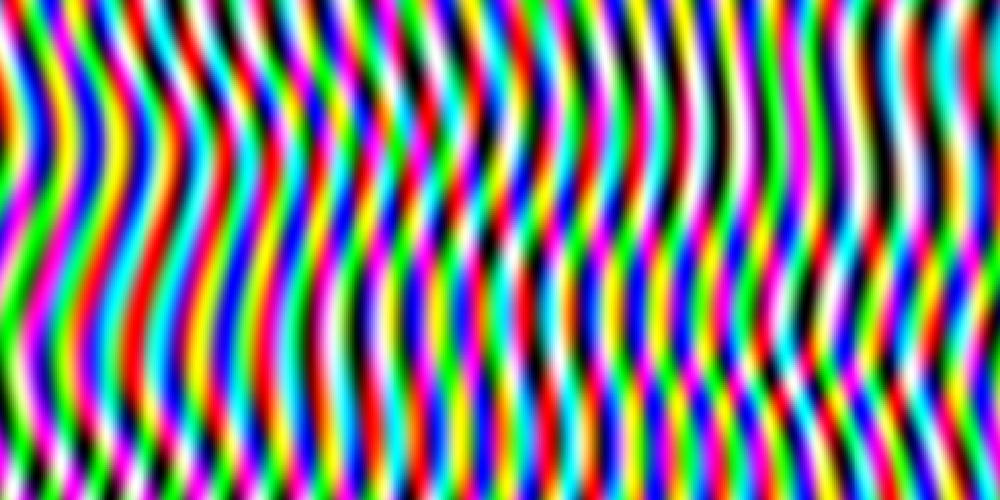

# Assignment 1: NumPy Array Manipulation for 2D Pattern Generation

[View on GitHub]({{ site.github.repository_url }})



## Objective

The goal of this assignment is to create a Python program using NumPy to manipulate a 2-dimensional array and transform a blank canvas into a patterned image. You are asked apply various array operations, introduce randomness, and work with RGB channels to produce full-color images.

---

## Table of Contents

- [Tasks](#tasks)
- [Getting Started](#getting-started)
- [Repository Structure](#repository-structure)
- [Instructions](#instructions)
- [Inspiration](#inspiration)
- [Exploring Advanced Libraries](#exploring-advanced-libraries)
- [Submission Guidelines](#submission-guidelines)
- [Evaluation Criteria](#evaluation-criteria)
- [Resources](#resources)
- [Contact](#contact)

---

## Tasks

1. **Initialize a Blank Canvas**
   - Create an empty 2D NumPy array representing a blank image.

2. **Array Manipulation**
   - Use NumPy functions for slicing, indexing, and shape manipulation to create patterns (e.g., stripes, checkerboards, gradients).

3. **Introduce Randomness**
   - Employ NumPy's random module to add variability and uniqueness to your design.

4. **Work with RGB Channels**
   - Extend your array into a 3D array to include RGB color channels.
   - Assign different colors to different parts of your pattern.

5. **Visualization**
   - Display and save your generated images using libraries like `matplotlib` or `PIL`.

6. **Documentation**
   - Write pseudo-code and provide a technical explanation of your transformation processes.
   - Include visual diagrams if necessary.

---

## Getting Started

### Prerequisites

- **Python 3.x**
- **NumPy**
- **Matplotlib**

### Installation

Install dependencies using `pip` as needed:

```bash
pip install numpy matplotlib
```

---

## Repository Structure

```
A1/
├── index.md                    # Do not edit front matter or content
├── README.md                   # Project documentation; Keep front matter, replace the rest with your project documentation
├── BRIEF.md                    # Assignment brief; Do not edit front matter or content
├── pattern_generator.py        # Your code implementation
└── images/                     # Add diagram, intermediary, and final images here
    ├── perlin_moire.png        # Assignment brief image; Do not delete
    └── ...
```

- `README.md`: This file; update this file with your assignment write-up.
- `pattern_generator.py`: The Python script where you will write your code.
- `TEMPLATE.md`: Markdown fil template for your pseudo-code and technical explanations.
- `images/`: Directory to save your generated images.

---

## Instructions

1. **Clone the Repository**

   - In GitHub Classroom, accept the assignment and clone the repository using GitHub Desktop or the command line.

2. **Set Up Your Environment**

   - Ensure all dependencies are met.
   - Familiarize yourself with the repository structure.

3. **Implement the Tasks**

   - Open `pattern_generator.py`.
   - Develop your own approach to generate unique 2D patterns.
   - Add comments to explain your code.

4. **Version Control with Git**

   - Make regular commits with meaningful messages.
   - Push your commits to the GitHub repository.

5. **Generate and Save Images**

   - Run your script to generate patterns.
   - Save the output images in the `images/` folder.

6. **Document Your Work**

   - Open `TEMPLATE.md`.
   - Write your pseudo-code outlining the logic of your program.
   - Provide a technical explanation (max 300 words) of your transformations.
   - Include any output images or diagrams (optional) in your submission.

7. **Review and Finalize**

   - Ensure your code is well-commented and clean.
   - Double-check your documentation for clarity and completeness.
   - Verify that all generated images are saved in the correct folder.

---

## Inspiration

To spark your creativity, here are some examples of patterns and designs that can be generated through pixel-level manipulation. Exploring these concepts might inspire your own unique patterns.

### 1. Conway's Game of Life

- **Description**: A cellular automaton devised by mathematician John Conway. It consists of a grid of cells that evolve through iterations based on simple rules, leading to complex behaviors.

- **Learn More**:
  - [Wikipedia](https://en.wikipedia.org/wiki/Conway%27s_Game_of_Life)
  - [Interactive Simulator](https://playgameoflife.com/)

### 2. Perlin Noise

- **Description**: A type of gradient noise used to create natural appearing textures on computer-generated surfaces. Commonly used for procedural texture generation.

- **Learn More**:
  - [Wikipedia](https://en.wikipedia.org/wiki/Perlin_noise)

### 3. Turing (Reaction-Diffusion) Patterns

- **Description**: Patterns that arise from the reaction-diffusion system described by Alan Turing, leading to patterns like spots and stripes in animal coats.

- **Learn More**:
  - [Wikipedia](https://en.wikipedia.org/wiki/Turing_pattern)

### 4. Random Walks and Brownian Motion

- **Description**: Paths that consist of a succession of random steps, which can be visualized as patterns.

- **Learn More**:
  - [Wikipedia](https://en.wikipedia.org/wiki/Brownian_motion)

### 5. Sine Wave Interference Patterns

- **Description**: Combining multiple sine waves can create interference patterns, resulting in interesting visual effects.

- **Learn More**:
  - [Wikipedia](https://en.wikipedia.org/wiki/Wave_interference)

### 6. Dithering Algorithms

- **Description**: Techniques to simulate color depth variations using patterns, such as Floyd-Steinberg dithering.

- **Learn More**:
  - [Wikipedia](https://en.wikipedia.org/wiki/Dither)
  - [Dithering Explained](https://surma.dev/things/ditherpunk/)

Feel free to explore such tangential concepts and incorporate ideas from them into your assignment. Remember, creativity and originality are encouraged!

---

## Exploring Advanced Libraries

While NumPy and Matplotlib are powerful tools for array manipulation and visualization, exploring additional libraries can enhance your capabilities and open up new possibilities. Below are two well established libraries you might find interesting to use in this assignment:

### 1. scikit-image (`skimage`)

**Description**:

- **scikit-image** is an open-source image processing library for Python. It provides a collection of algorithms for image processing, including filtering, morphology, feature detection, and more.

**Key Features**:

- **Image Filtering**: Apply filters like Gaussian blur, edge detection, etc.
- **Morphological Operations**: Perform dilation, erosion, opening, and closing.
- **Feature Detection**: Detect corners, blobs, and other features.
- **Color Space Conversion**: Convert images between different color spaces.

**Installation**:

```bash
pip install scikit-image
```

**Example Use**:

```python
from skimage import data, filters, color
import matplotlib.pyplot as plt

# Load an example image
image = data.coins()

# Apply edge detection filter
edges = filters.sobel(image)

# Display the original and processed images
fig, ax = plt.subplots(1, 2, figsize=(10, 5))
ax[0].imshow(image, cmap='gray')
ax[0].set_title('Original')
ax[0].axis('off')

ax[1].imshow(edges, cmap='gray')
ax[1].set_title('Edges')
ax[1].axis('off')

plt.show()
```

**Learn More**:

- [scikit-image Documentation](https://scikit-image.org/docs/stable/)
- [scikit-image Tutorials](https://scikit-image.org/docs/stable/auto_examples/)

---

### 2. OpenCV (`cv2`)

**Description**:

- **OpenCV** (Open Source Computer Vision Library) is a comprehensive library for computer vision and image processing. It supports a wide range of operations, including image transformations, feature detection, object recognition, and more.

**Key Features**:

- **Image and Video I/O**: Read and write images and videos.
- **Geometric Transformations**: Resize, rotate, warp, and affine transformations.
- **Color Space Conversion**: Convert images between color spaces.
- **Filtering**: Apply various filters for smoothing, sharpening, etc.

**Installation**:

```bash
pip install opencv-python
```

**Example Use**:

```python
import cv2
import numpy as np
import matplotlib.pyplot as plt

# Create a blank canvas
canvas = np.zeros((200, 200, 3), dtype=np.uint8)

# Draw a red circle
center_coordinates = (100, 100)
radius = 50
color = (0, 0, 255)  # OpenCV uses BGR format
thickness = -1  # Fill the circle
cv2.circle(canvas, center_coordinates, radius, color, thickness)

# Convert BGR to RGB for displaying with Matplotlib
canvas_rgb = cv2.cvtColor(canvas, cv2.COLOR_BGR2RGB)

# Display the image
plt.imshow(canvas_rgb)
plt.axis('off')
plt.show()
```

**Learn More**:

- [OpenCV Documentation](https://docs.opencv.org/master/)
- [OpenCV Python Tutorials](https://docs.opencv.org/master/d6/d00/tutorial_py_root.html)

---

### How to Integrate These Libraries into Your Assignment

- **Advanced Processing**: Use `skimage` or `OpenCV` to apply advanced image processing techniques to your patterns, such as filters (`gaussian`, `sobel`, `threshold`, etc.) or geometric transformations (`rotate`, `scale`, etc.).

- **Additional Functionality**: Explore functionalities like morphological operations (`erode`, `dilate`, etc.) to enhance your patterns.

- **Color Space Manipulation**: Experiment with different color spaces (e.g., HSV, LAB) to create unique color effects.

**Note**:

- While exploring these libraries is encouraged, ensure that you understand the methods you are using and can explain them in your documentation.

---

## Submission Guidelines

- **What to Submit**:
  - Updated `pattern_generator.py` with your code.
  - Completed `README.md` with pseudo-code and explanations.
  - Generated images in the `images/` folder.
  - Ensure all changes are committed and pushed to your GitHub repository.

- **Submission Checklist**:
    - [ ] `pattern_generator.py` is implemented and the code runs without errors.
    - [ ] The code is well-commented, explaining each major step.
    - [ ] `README.md` is filled out completely.
    - [ ] Generated images are saved in the `images/` folder and referenced in your documentation if needed.
    - [ ] All changes are committed with meaningful messages.
    - [ ] All commits are pushed to your GitHub repository.

---

## Evaluation Criteria

- **Correct Application of Array Manipulation Methods**
  - Effective use of array operations to create patterns.
  - Creativity in design and manipulation.

- **Technical Explanation**
  - Clarity and depth of your pseudo-code.
  - Ability to explain how your code results in the final pattern.

- **Code Quality**
  - Clean, readable, and well-commented code.
  - Logical organization and structure.

- **Use of Git**
  - Regular commits with meaningful messages.
  - Proper repository structure.

- **Documentation**
  - Well-formatted `README.md` using Markdown.
  - Inclusion of images and diagrams where appropriate.

---

## Resources

- **NumPy Documentation**: [https://numpy.org/doc/](https://numpy.org/doc/)
- **Matplotlib Documentation**: [https://matplotlib.org/stable/contents.html](https://matplotlib.org/stable/contents.html)
- **scikit-image Documentation**: [https://scikit-image.org/docs/stable/](https://scikit-image.org/docs/stable/)
- **OpenCV Documentation**: [https://docs.opencv.org/master/](https://docs.opencv.org/master/)
- **Markdown Guide**: [Reference Repo - markdown](https://github.com/AdvancedComputationalDesign-SDU/ACD-E24-Reference/tree/main/markdown)
- **GitHub Desktop Guide**: [Reference Repo - git](https://github.com/AdvancedComputationalDesign-SDU/ACD-E24-Reference/tree/main/git)

---

## Contact

If you have any questions or need clarification, please reach out to your instructor.

---
