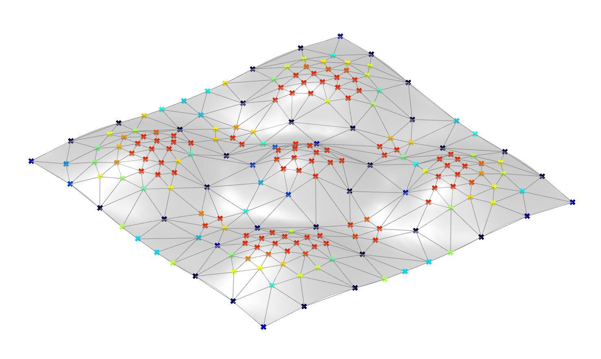

# Assignment 4: Agent-Based Modeling for Surface Panelization

[View on GitHub]({{ site.github.repository_url }})



## Objective

In this assignment, you will develop an **agent-based system for surface rationalization** using **Object-Oriented Programming (OOP)** in Python. Building on the surface you generated in Assignment 3 (or a comparable heightmap-driven surface), you will design agents that respond to geometric signals and collectively produce **panelization patterns**. The core idea is that agents move, interact, and make decisions based on how they sample the geometry, and their trajectories and interactions become the basis for a rationalized panelization of that surface.

Your implementation must incorporate **at least two types of geometric signals** (chosen from curvature, slope, vector fields, scalar fields, and spatial influences) when defining agent behavior. The primary outputs of this assignment are: (1) a rationalized panelization of your surface and (2) simulated agent trajectories and fields that you document and analyze.

---

## Table of Contents

- [Learning Goals](#learning-goals)
- [Tasks](#tasks)
- [Repository Structure](#repository-structure)
- [Instructions](#instructions)
- [Ideas for Exploration](#ideas-for-exploration)
- [Submission Guidelines](#submission-guidelines)
- [Evaluation Criteria](#evaluation-criteria)
- [Resources](#resources)
- [Contact](#contact)

## Learning Goals

- Develop proficiency in **Object-Oriented Programming (OOP)** within Python3 for Grasshopper.
- Understand and apply **agent-based modeling** to architectural geometry.
- Incorporate **geometric signals**—curvature, slope, vector fields, scalar fields, spatial influences to guide agent behavior.
- Implement multi-step simulations where agents evolve states over time.
- Rationalize complex surfaces through **simulation-driven panelization** and geometric analysis.
- Structure code into **modular Python3 scripts**, separating surface generation, class definitions, and simulation logic.
- Document computational design logic clearly through pseudo-code and technical explanation.

---

## Tasks

1. **Design and Implement an Agent-Based Model**

   - Split your implementation across at least three modules:
     - **surface_generator.py** — base surface generation using a NumPy heightmap (or comparable scalar field)
     - **agent_builder.py** — agent class definitions + agent initialization
     - **agent_simulator.py** — simulation loop, update logic, state evolution
     - *(Optional)* additional modules (e.g., `field_generator.py`, `panelization.py`, `visualization_utils.py`) if it helps organize your codebase.
   - Define classes to represent agents and encapsulate their behaviors and interactions.
   - Implement algorithms that govern agent behaviors and how they affect the emergent behavior and resulting panelization.
   - Ensure that your agents explicitly read and respond to **at least two geometric signals** (curvature, slope, vector fields, scalar fields, spatial influences).
   - Consider **agent life-cycle rules**, where agents can spawn new agents, be removed, or respawn based on geometric signals (e.g., curvature thresholds, scalar field values) or interaction rules.
   - Your agents must read and react to **at least two** of the following categories of geometric signals:

      ### Curvature

      Curvature describes how much and in what way the surface bends at a point. You can use:

      - **Mean curvature, Gaussian curvature, principal curvatures, or curvature radius** to decide where panels should be smaller, denser, or more subdivided.
      - Curvature values to influence agent speed (slow down in high curvature regions), direction (align with principal curvature directions), or separation (for example, increasing lateral distance between neighboring agents in low-curvature, flatter zones while allowing denser clustering where curvature is higher).
      Agents can, for example, slow down and cluster more tightly in high-curvature regions, while spreading apart or maintaining greater spacing on flatter, low-curvature areas, and reorient their direction along principal curvature lines.

      ```python
      # Curvature queries
      rs.SurfaceCurvature(surface_id, (u, v))       # curvature information
      rs.SurfaceDomain(surface_id, direction)       # map normalized UV to surface domain
      rs.EvaluateSurface(surface_id, u, v)          # evaluate surface point and derivatives
      rs.SurfaceNormal(surface_id, (u, v))          # surface normal vector
      ```

      ### Slope (Gradient)

      Slope measures how steep the surface is at a given point. You can:
      - Guide agents along steepest descent (rain-flow behavior) or steepest ascent.
      - Avoid or target zones where the slope magnitude exceeds a threshold.
      - Combine slope with curvature to locate geometrically "critical" regions.

      ```python
      # Example: approximating slope using NumPy finite differences and rs.EvaluateSurface
      import numpy as np
      import rhinoscriptsyntax as rs

      # heightmap H has shape (H, W)
      dH_du = np.gradient(H, axis=1)
      dH_dv = np.gradient(H, axis=0)
      slope_mag = np.sqrt(dH_du**2 + dH_dv**2)

      # Or sample nearby UVs on a Rhino surface
      pt_center = rs.EvaluateSurface(surface_id, u, v)
      pt_u = rs.EvaluateSurface(surface_id, u + du, v)
      pt_v = rs.EvaluateSurface(surface_id, u, v + dv)
      slope_vector = [pt_u[i] - pt_center[i] for i in range(3)]
      ```


      ### Scalar Fields (UV-Mapped, shape H x W)

      Scalar fields assign a single value (a float) to each UV sample. Conceptually, this is a NumPy array of shape `(H, W)` (height × width). Agents can use scalar values to decide when to despawn, slow down, or change direction. Scalar fields are typically aligned with a UV sampling of the surface or its heightmap.

      ```python
      # Example: reading a scalar field and thresholding
      import numpy as np

      # scalar_field has shape (H, W)
      value = scalar_field[v_idx, u_idx]

      # Agents respond to threshold
      if value > threshold:
          agent.despawn()
      ```

      ### Vector Fields (UV-Mapped, shape H x W x 2)

      Vector fields assign a 2D direction vector to each UV sample. Conceptually, this is a NumPy array of shape `(H, W, 2)` (height × width × 2), where each entry stores a vector in UV space (for example, a preferred movement direction or flow). Agents can use vector values to steer their motion, bias turning, or blend with other directions (such as curvature directions or slope).

      ```python
      # Example: reading a UV-mapped vector field
      import numpy as np

      # vector_field has shape (H, W, 2)
      u_idx = int(u * (W - 1))
      v_idx = int(v * (H - 1))

      vector_uv = vector_field[v_idx, u_idx]      # [du, dv] in UV space

      # Normalize and blend with another direction, e.g. curvature_dir_uv
      if np.linalg.norm(vector_uv) > 1e-6:
          vector_uv = vector_uv / np.linalg.norm(vector_uv)

      direction_uv = alpha * curvature_dir_uv + (1 - alpha) * vector_uv
      ```

      ### Spatial Influences (Attractor / Repulsor / Obstacle Geometry)

      Spatial signals come from 3D geometry in the Rhino scene: points, curves, surfaces, or meshes that act as **attractors**, **repulsors**, or **obstacles**. Agents can be attracted toward or repelled from reference geometries, or stop/respawn when entering specific regions, using simple distance and projection queries.

      ```python
      # Example: spatial influence queries
      import rhinoscriptsyntax as rs

      dist = rs.Distance(agent_pt, attractor_pt)
      closest_curve_t = rs.CurveClosestPoint(curve_id, agent_pt)
      closest_surface_uv = rs.SurfaceClosestPoint(surface_id, agent_pt)

      # Projection examples
      proj_pt_srf = rs.ProjectPointToSurface([agent_pt], surface_id, [0,0,-1])[0]
      proj_pt_mesh = rs.ProjectPointToMesh([agent_pt], mesh_id, [0,0,-1])[0]
      ```

      In your design, you are free to choose any two (or more) of these signal categories. The crucial requirement is that agents **explicitly read from these fields or geometries** and that these readings have a clear effect on their behavior and on the final panelization.


2. **Explore Parameter Variations**

   - Experiment with different rules, parameters, and initial conditions.
   - Analyze how changes in agent behaviors influence the resulting patterns.
   - Document your findings and include visual examples of different outcomes.

3. **Documentation**

   - Write detailed pseudo-code explaining your classes and algorithms in README.md.
   - Provide technical explanations of your design choices and how OOP principles are applied.
   - Include a report discussing the rationale behind the chosen rules and their impact on the final model.
   - Insert images of your generated models into the documentation.

---

## Repository Structure
```
A4/
├── index.md                    # Do not edit front matter or content
├── README.md                   # Project documentation; Keep front matter, replace the rest with your project documentation
├── BRIEF.md                    # Assignment brief; Do not edit front matter or content
├── agent_panelization.gh       # Your grasshopper definition
├── surface_generator.py        # Your surface_generator implementation
├── agent_builder.py            # Your agent_builder implementation
├── agent_simulator.py          # Your agent_simulator implementation
├── ...                         # Any additional implementation
└── images/                     # Add diagram, intermediary, and final images here
    ├── agent_based.png         # Assignment brief image; Do not delete
    └── ...
```

---

## Instructions

1. **Clone the Repository**

   - Accept the assignment on GitHub Classroom and clone the repository to your local machine.

2. **Plan Your Project**

   - Decide on the focus of your agent-based model.
   - Sketch out ideas and consider how OOP principles will be applied.
   - Identify the agents, their properties, and behaviors.

3. **Implement the Agent-Based Model**

   - **Define Agent Classes**:

     - Create classes representing agents with attributes and methods.
     - Consider inheritance and polymorphism if appropriate.
     - Implement these classes and initialize agent instances in **agent_builder.py**.

   - **Implement Behaviors and Interactions**:

     - Define how agents interact with each other and their environment.
     - Use algorithms to govern agent behaviors (e.g., rules, state machines, decision trees).
     - Implement the simulation loop, update logic, and state evolution in **agent_simulator.py**.
     - Implement any **spawning, removal, or respawn logic** for agents (for example, when agents enter certain regions, exceed a maximum age, or when geometric thresholds are crossed).

   - **Model Evolution Over Time**:

     - Implement a simulation loop or time-stepping mechanism.
     - Allow agents to update their state and influence the model over time.

   - **Visualization**:

     - Use Rhino/Grasshopper to visualize the results.
     - Ensure that the generated models effectively communicate the agent behaviors and resulting patterns.

4. **Experiment with Parameters**

   - Create parameters that can be adjusted to alter agent behaviors.
   - Experiment with different values and document the effects on the final model.
   - Consider implementing user input mechanisms to facilitate exploration.

5. **Align with Personal Interests**

   - Adapt the project to align with your studio or research work.
   - Feel free to explore alternative challenges or extend the scope of the project.

6. **Document Your Work**

   - Write detailed pseudo-code in README.md explaining your classes and algorithms.
   - You may use **TEMPLATE.md** as a starting point for structuring your README, adapting or extending it as needed.
   - Provide technical explanations and discuss how OOP principles are applied.
   - Include images and explanations of different design variations.
   - Discuss any challenges faced and how you overcame them.

7. **Version Control with Git**

   - Make regular commits with meaningful messages.
   - Push your commits to the GitHub repository.

8. **Review and Finalize**

   - Ensure your code is well-commented and organized.
   - Verify that all generated images are saved correctly.
   - Double-check your documentation for clarity and completeness.

---

## Ideas for Exploration

To challenge yourself and expand the scope of your project, consider exploring how different combinations of **curvature**, **slope**, **vector fields**, **scalar fields**, and **spatial relationships** can influence or rationalize your surface.

- **Multi-Agent Systems**:

  - Create a system with different types of agents interacting.
  - Explore emergent behaviors resulting from agent interactions.

- **User Interaction**:

  - Develop an interactive application where users can influence the simulation in real-time.
  - Implement GUI elements or use interactive sliders in Grasshopper.

- **Optimization and Performance**:

  - Optimize your code for performance, especially if dealing with large numbers of agents.
  - Explore parallel computing or optimized data structures.

---

## Submission Guidelines

- **What to Submit**:

  - Your **surface_generator.py**, **agent_builder.py**, and **agent_simulator.py** scripts (plus any additional Python modules you created).
  - Completed README.md with pseudo-code, explanations, and images.
  - Generated images saved in the images/ folder.
  - At least **three** rendered images showing **visually distinct design variations**, and at least **one** image or diagram that explicitly visualizes agent trajectories and/or underlying fields (e.g., curvature, slope, vector fields, scalar field).
  - Any additional documentation or resources in the docs/ folder.

- **Submission Checklist**:

  - [ ] Code runs without errors.
  - [ ] Code is well-commented and follows best practices.
  - [ ] README.md is complete and thorough.
  - [ ] Visualizations of different outcomes are saved and referenced in your documentation.
  - [ ] All changes are committed with meaningful messages and pushed to your GitHub repository.

---

## Evaluation Criteria

- **Implementation and Functionality**

  - Effective use of OOP principles in the design of the agent-based model.
  - Correct implementation of agent behaviors and interactions.
  - Ability of the model to evolve over time and generate structural patterns.

- **Design Exploration**

  - Creativity and originality in agent behaviors and resulting patterns.
  - Clear exploration of parameter and signal variations (at least three distinct configurations) and discussion of their impact on the resulting panelization.

- **Technical Understanding**

  - Demonstrated understanding of OOP concepts and agent-based modeling.
  - Clear explanations in code comments and documentation.

- **Code Quality**

  - Clean, readable, and well-organized code.
  - Use of meaningful variable names and proper formatting.

- **Documentation**

  - Detailed pseudo-code and technical explanations.
  - Inclusion and discussion of generated design variations.
  - Discussion of challenges and solutions.

- **Use of Git and Version Control**

  - Regular commits with meaningful messages.
  - Proper repository structure and organization.

---

## Resources

- **Object-Oriented Programming in Python**

  - [Official Python Tutorial - Classes](https://docs.python.org/3/tutorial/classes.html)
  - [Real Python - Object-Oriented Programming](https://realpython.com/python3-object-oriented-programming/)

- **Python in Rhino and Grasshopper**
  - [Rhino.Python Guides](https://developer.rhino3d.com/guides/rhinopython/)
  - [RhinoScriptSyntax](https://developer.rhino3d.com/api/RhinoScriptSyntax/)

---

## Academic Integrity and AI Tool Use
- You may use AI tools for **boilerplate, refactoring, linting, and debugging**. If you do, you must:
  1. **Cite** the tools and prompts you used in your `README.md` under a short **AI Acknowledgments** subsection.
  2. Keep **algorithmic choices** and the **core implementation** your own. Do not submit turnkey solutions.
  3. Be prepared to **explain any part of your code** (live or written). You may be asked to walk through it.
- **Prohibited**: uncredited copying from classmates or the internet; submitting code/images you do not understand; using AI to generate the entire assignment without substantive modification.

## Contact

If you have any questions or need assistance, please reach out via email or the course forum.

---
